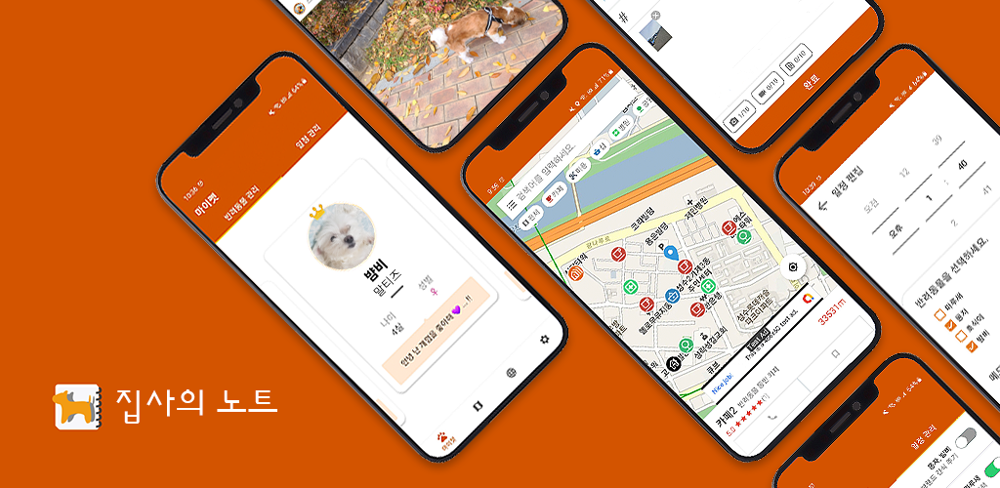

# Bulter's Note - Management service for your companion
## Backend API Server

## 목차

- [1. 프로젝트 소개](#1-프로젝트-소개)
- [2. 프로젝트 주요 기능](#2-프로젝트-주요-기능)
- [3. 프로젝트 개발물](#3-프로젝트-개발물)
  * [3-1. 백엔드 이미지 처리 서비스를 통한 이미지 최적화](#3-1-백엔드-이미지-처리-서비스를-통한-이미지-최적화)
  * [3-2. HTTP Range Request를 통한 비디오 스트리밍](#3-2-http-range-request를-통한-비디오-스트리밍)

## 1. 프로젝트 소개

반려동물에 대한 종합 관리와 정보 공유로 반려동물과 함께 지내는 사용자들에게 유용한 서비스를 제공하는 안드로이드 기반 플랫폼 서비스입니다.

## 2. 프로젝트 주요 기능

## 3. 프로젝트 개발물

### 3-1. 백엔드 이미지 처리 서비스를 통한 이미지 최적화

**Reference**: [백엔드 이미지 처리 서비스를 통한 이미지 최적화](https://bit.ly/3DoKhDy)

백엔드 파일 업로드/스트리밍 API 구축 이후, 안드로이드 앱이 이미지 크기로 느려지는 현상을 imgscalr 오픈소스를 활용한 이미지 최적화 서비스를 구축하여 해결하였습니다.

이를 통해 일반 화질 이미지는 원본 대비 14배 가량 데이터 크기를 줄였으며, 썸네일 이미지는 원본 대비 72배 가량 데이터 크기를 줄여 미디어의 다운로드 트래픽을 크게 감소시켰습니다.

### 3-2. HTTP Range Request를 통한 비디오 스트리밍

**Reference**: [HTTP Range Request를 통한 비디오 스트리밍](https://bit.ly/3sMXykd)

안드로이드 애플리케이션에 대용량의 비디오를 스트리밍하기 위해 파일을 range에 따라 분할하여 전송하는 HTTP Range Request 방식을 도입하였습니다.

이를 통해 안드로이드가 제공하는 videoView의 setVideoPath() 함수를 통해 HTTP Range Request를 받아 비디오를 원할하게 스트리밍 할 수 있었습니다.
